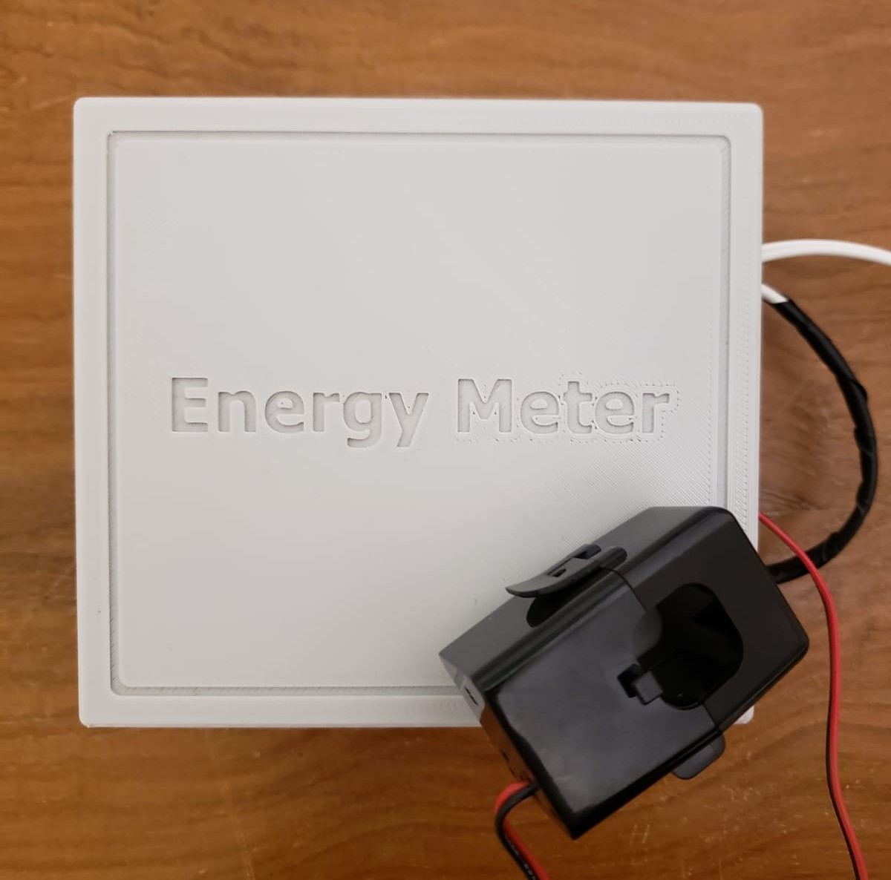
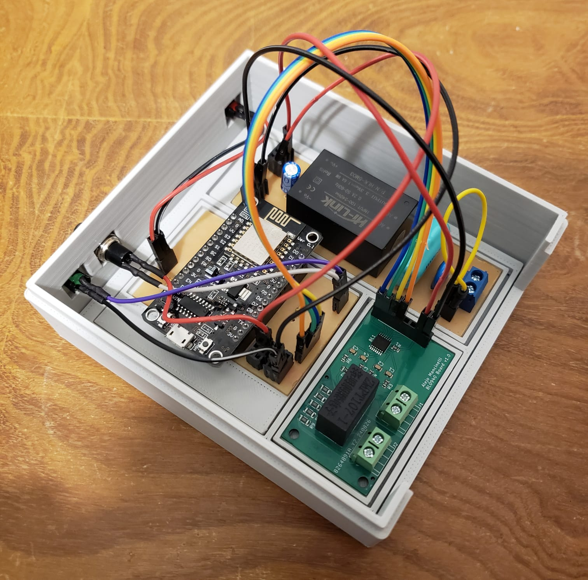
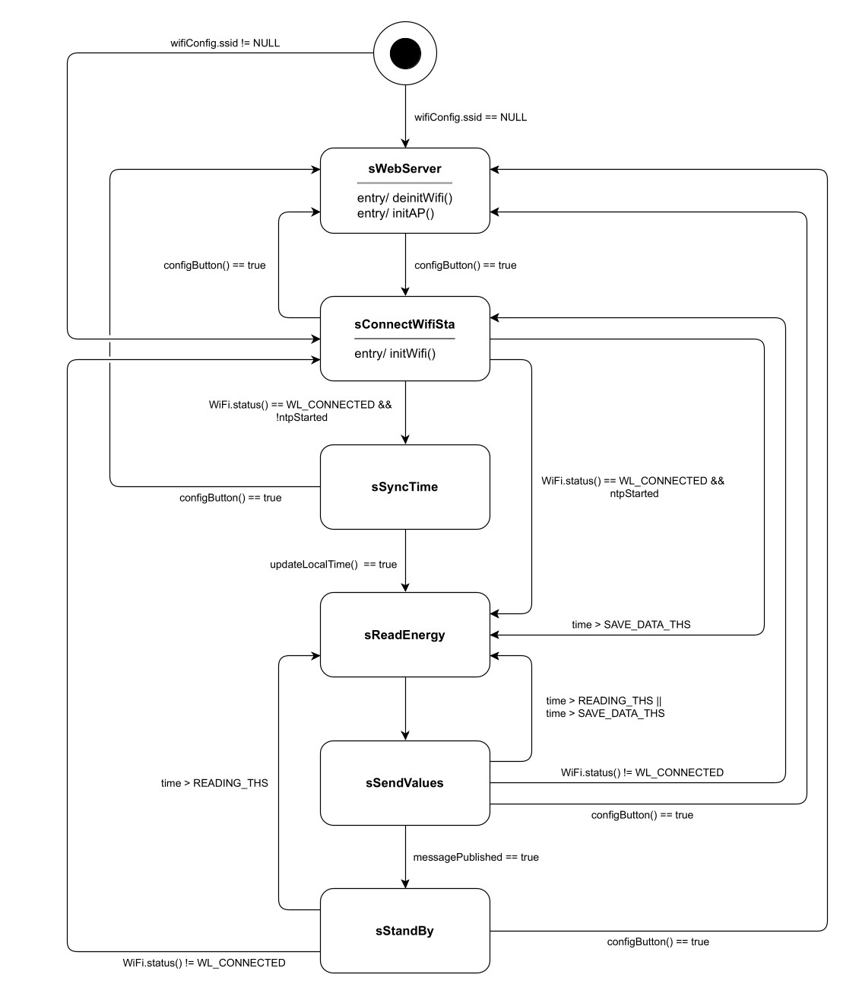

# FCEIA_ProyectoFinal
Proyecto Final de Ing. Electrónica: Sistema de monitoreo de red eléctrica doméstica y/o industrial.

En este repositorio se encuentran los distintos progamas utilizados, así como diversos tests de prueba. Para correr el sistema en conjunto, se deben modificar las rutas de archivo según corresponda, o utilizar la versión con Docker.





## Configuración del ESP8266
La placa ESP8266 NodeMCU v3 es utilizada para el prototipo. Para conectarse, es necesario instalar el controlador CH340G siguiendo las instrucciones en [este tutorial](https://www.instructables.com/Instalar-driver-para-CH340G/).

Además de esto, se debe agregar los kits de desarrollo ESP8266 al IDE de Arduino siguiendo los isguiente pasos:

1. Abrir el IDE de Arduino, seleccionar `Archivo -> Preferencias` y escribir `http://arduino.esp8266.com/stable/package_esp8266com_index.json` en el campo de URLs adicionales del Gestor de Placas. Se pueden agregar múltiples URLs separándolas con comas.

2. Abrir el Gestor de Placas desde `Tools -> Board -> Boards Manager` e instalar la plataforma esp8266. Para encontrarla fácilmente, buscar "ESP8266" en la barra de búsqueda.

3. Seleccionar el módulo ESP8266 que se esté utilizando. En este caso, seleccionar **NodeMCU 1.0 (ESP-12E Module)**.

4. Dirigirse a `Herramientas -> Puerto` y selecciona el puerto correspondiente al dispositivo. 

## Instalación de librerías
Es necesario instalar las siguientes librerías en el IDE de Arduino:

- LittleFS
- WiFiUdp
- ESPAsyncWebServer
- ESPAsyncTCP
- PubSubClient
- NTPClient
- ArduinoJson

## LittleFS
LittleFS es un sistema de archivos liviano creado para microcontroladores que permite acceder a la memoria flash como se haría en un sistema de archivos estándar en la computadora, pero es más simple y limitado. Es posible leer, escribir, cerrar y eliminar archivos y carpetas.

### Filesystem Uploader
Antes de continuar, es necesario tener instalado el complemento ESP8266 Uploader Plugin en el IDE de Arduino.

- [ArduinoIDE 1.8.x](https://randomnerdtutorials.com/install-esp8266-nodemcu-littlefs-arduino/)
- [ArduinoIDE 2.1.1 or higher](https://randomnerdtutorials.com/arduino-ide-2-install-esp8266-littlefs/)

### MEF



## Raspberry Pi Model 3 B+

La Raspberry Pi Model 3 B+ es una computadora de placa reducida con conectividad WiFi y Ethernet que se utilizará como servidor en este proyecto. Se utiliza la versión Raspbian 11 (bullseye), la cual debe cargarse en una tarjeta microSD mediante la herramienta Raspberry Pi Imager.

### Mosquitto MQTT Broker

Mosquitto es un broker MQTT liviano y de código abierto que se utiliza para la comunicación entre dispositivos mediante el protocolo MQTT.


**1)** Actualizar el sistema 

```
sudo apt-get update && sudo apt-get upgrade
```

**2)** Instalar el broker Mosquitto

```
sudo apt install -y mosquitto mosquitto-clients
``` 

**3)** Ejecutar el sigiuente comando para abrir el archivo mosquitto.conf

```
sudo nano /etc/mosquitto/mosquitto.conf
```

**4)** Ir al final del archivo utilizando las flechas del teclado y pegar las siguientes dos líneas

```
listener 1883
allow_anonymous true
```

Esto permite la conexión de dispostivos remotos en el puerto 1883

**5)** Para que Mosquitto se inicie automáticamente cuando arranca la Raspberry Pi, se debe ejecutar el siguiente comando (esto significa que el broker Mosquitto se iniciará automáticamente al encender la Raspberry Pi):

```
sudo systemctl enable mosquitto.service
```

Mosquitto también puede ejecutarse en segundo plano. Esto debe hacerse cada vez que se enciende la Raspberry Pi.

```
mosquitto -d
```

Se puede comprobar que todo funciona correctamente creando un publicador y un suscriptor en terminales separadas:

```
mosquitto_sub -d -t testTopic
```
```
mosquitto_pub -d -t testTopic -m "Hello world!"
```

### SQLite

SQLite es un sistema de gestión de bases de datos ligero y autónomo que no requiere configuración ni servidor. Es ideal para proyectos embebidos como este, ya que permite almacenar y consultar datos de forma local en la Raspberry Pi de manera eficiente y con bajo consumo de recursos.

**1)** Instalar SQLite utilizando el siguiente comando:
```
sudo apt-get install sqlite3
```

**2)** Crear una base de datos en el directorio actual 

```
sqlite3 
sqlite> .save nombre_de_la_base_de_datos.db
sqlite> .quit
```

Tablas utilizadas:

#### db_raw_data
| Column | Type | Description |
| -------- | -------- | -------- |
| id | INTEGER | Primary key, auto-incrementing |
| datetime | TEXT | Timestamp of the data (YYYY-MM-DD hh:mm:ss)
| voltage_rms | NUMERIC | Root Mean Square (RMS) voltage |
| current_rms | NUMERIC | Root Mean Square (RMS) current |
| active_power | NUMERIC | Active power measurement |
| active_energy | NUMERIC | Cumulative active energy |
| power_factor | NUMERIC | Power factor |

#### db_alarm_settings
| Column | Type | Description |
| -------- | -------- | -------- |
| key | TEXT | Primary key, unique setting identifier |
| value | FLOAT | Numeric value for the setting (e.g., threshold) |
| state | INTEGER | Current state of the alarm (e.g., 0 for off, 1 for on) |

#### db_alarm_historic
| Column | Type | Description |
| -------- | -------- | -------- |
| id | INTEGER | Primary key, auto-incrementing |
| datetime | TEXT | Timestamp when the alarm occurred |
| alarmtype | TEXT | Type or name of the triggered alarm |
| value | FLOAT | Value that triggered the alarm |
| threshold | FLOAT | The threshold value that was exceeded

#### db_mailing_list
| Column | Type | Description |
| -------- | -------- | -------- |
| id | INTEGER | Primary key, auto-incrementing |
| username | TEXT | User's name |
| email | TEXT | User's email address |

### Node Red

Node-RED es una herramienta de desarrollo basada en flujo que permite programar visualmente aplicaciones. Se utilizará para crear la interfaz de usuario e integrar las distintas etapas del proyecto. 

**1)** Instalar Node-RED utilizando el siguiente comando

```
bash <(curl -sL https://raw.githubusercontent.com/node-red/linux-installers/master/deb/update-nodejs-and-nodered)
```

Para ejectuar Node-Red mediante SSH utilizar el siguiente comando:

```
nohup node-red &
```

Usar solo el comando `node-red` vincula el proceso con la conexión SSH. Si la conexión se termina, el proceso se finalizará. Utilizar `nohup` evita esto.

Otra forma es iniciar Node-RED como un servicio con:

```
sudo systemctl start nodered.service
sudo systemctl status nodered.service
```

Para evitar tener que iniciar el servicio cada vez que se prende la Raspberry Pi, se puede configurar para que se ejecute automáticamente al encenderse con el siguiente comando:

```
sudo systemctl enable nodered.service
```

Ingresar la dirección `raspberrypi.local:1880` en la URL de un navegador para acceder a Node-RED. Cambiar *raspberrypi* por el nombre que corresponda.

**2)** Instalar el `node-red-dashboard`:

```
npm install node-red-dashboard
```

Para visualizar el dashboard, ingresar a `raspberrypi.local:1880/ui`. Cambiar *raspberrypi* por el nombre que corresponda.

**3)** Instalar `node-red-node-sqlite`, que puede tardar entre 15 a 20 min:

```
npm install node-red-node-sqlite
```

**4)** Instalar las dependencias necesarias siguiendo los pasos:

1. Abrir la interfaz web de Node-RED desde el navegador
2. Hacer clic en el menú (las tres barras horizontales) en la esquina superior derecha.
3. Seleccionar Manage palette (Gestionar paleta).   
4. Dirigirse a la pestaña Install (Instalar).
5. En el cuadro de búsqueda, escribir el nombre de cada paquete y presiona Enter.
6. Para cada paquete que aparece en la lista, hacer clic en el botón Install (Instalar) para agregarlo a tu Node-RED.

Los paquetes a instalar son:

- node-red-contrib-cx-alarm-log (versión ~1.1.2)
- node-red-contrib-ui-led (versión ~0.4.11)
- node-red-dashboard (versión ~3.6.5)
- node-red-node-email (versión ~3.0.2)
- node-red-node-sqlite (versión ~1.1.0)
- node-red-node-ui-table (versión ~0.4.3)
- node-threshold-control (versión ~0.0.8)

### Docker

Docker es una plataforma que permite crear, distribuir y ejecutar aplicaciones dentro de contenedores ligeros y portables. Estos contenedores incluyen todo lo necesario para que una aplicación funcione, lo que facilita su despliegue y ejecución en diferentes entornos sin conflictos.

Para instalar Docker, seguir los pasos del [siguiente tutorial](https://docs.docker.com/engine/install/raspberry-pi-os/).

Se creó un repositorio con todos los archivos necesarios para correr el proyecto con Docker. 

https://github.com/alejomancinelli/energyMeterDocker